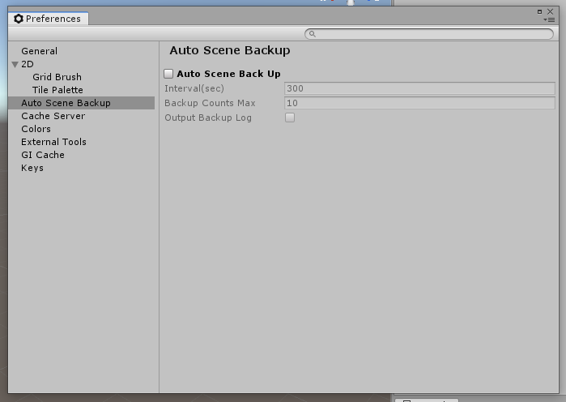

# Auto Scene Backup

Auto Scene Backup can automatically back up the scene you are working on and restore the scene. Auto Scene Backup is added to Preferences menu.

## Install
1. Download latest AutoSceneBackup.unitypackage from this link.
https://github.com/Accky/AutoSceneBackup/releases
2. Import AutoSceneBackup.unitypackage to your project.

## Usage
1. Open the [Preferences] menu.
2. Turn on the [Auto Scene Backup] toggle.
3. Set the interval time that is good for your project.
4. Set the number of backup history that is good for for your project.
5. If you need the backup log, turn on the [Output Backup Log] toggle.

## Restore Scenes
- Backup Scenes are in `Library/AutoSceneBackup/20XX-XX-XX_XX-XX-XX`.
- You select scene you want to restore, drag&drop or copy&paste to your Unity Project.

## Operation confirmed
- Unity 2018.4.10f1
- Visual Studio 2019 Community